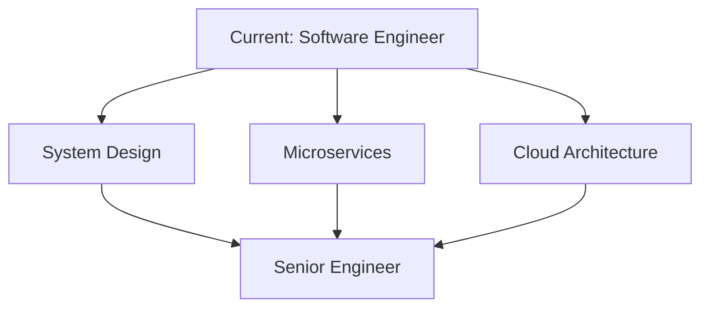

<div align="center">
  
</div>

<p align="center">
  
</p>

<div align="center">
  
[](https://www.linkedin.com/in/amith-r-sulakhe-056190230/)
[](mailto:amithsulakhe729@email.com)
[](https://yourportfolio.com)


</div>

<br/>


<br/>

##  About Me

```typescript
const amith = {
    pronouns: "He" | "Him",
    location: "Karnataka, India 🇮🇳",
    role: "Software Engineer",
    company: "Building Awesome Products",
    
    code: {
        frontend: ["React", "Next.js", "Redux", "TypeScript", "TailwindCSS"],
        backend: ["Node.js", "Express.js", "REST APIs"],
        database: ["MongoDB", "MySQL", "Mongoose"],
        devops: ["AWS", "Docker", "Nginx", "Linux"],
        tools: ["Git", "VS Code", "Postman", "npm"]
    },
    
    architecture: ["Microservices", "Event-Driven", "Serverless", "SPA"],
    currentFocus: "System Design & Cloud Architecture",
    funFact: "I turn coffee into code ☕→ 💻"
};
```

<br/>

<details open>
<summary><b>🎯 What I'm Up To</b></summary>
<br/>

- 🔭 Building **scalable full-stack applications** with MERN stack
- 🌱 Deep diving into **System Design & Microservices Architecture**
- 👯 Looking to collaborate on **innovative web projects**
- 💡 Exploring **AWS Cloud Services** and serverless architectures
- 🤝 Contributing to **Open Source** projects
- 💬 Ask me about **React, Next.js, Node.js, System Design**
- ⚡ Always learning, always coding!

</details>

<br/>


<br/>

##  Tech Stack

<div align="center">

### 🎨 Frontend


### ⚙️ Backend


### 🗄️ Database


### ☁️ DevOps & Cloud


### 🛠️ Tools


</div>

<br/>


<br/>

## 💼 Professional Journey

<table>
<tr>
<td width="50%">

### 🚀 Current Role
**Software Engineer**

 **Responsibilities:**
- Building full-stack applications with MERN
- Architecting scalable cloud solutions
- Implementing CI/CD pipelines
- Performance optimization & best practices
- Code reviews & mentoring

</td>
<td width="50%">

### 🎯 Learning Path



**Focus Areas:**
- Advanced System Design
- Distributed Systems
- AWS Solutions Architect
- Open Source Contributions

</td>
</tr>
</table>

<br/>


<br/>

## 🤝 Let's Connect & Collaborate!

<div align="center">

<p>I'm always excited to work on innovative projects and connect with fellow developers!</p>

<table>
<tr>
<td align="center" width="33%">
 <br>
<sub><b>💼 Professional</b></sub><br>
<a href="https://www.linkedin.com/in/amith-r-sulakhe-056190230/">

</a>
</td>
<td align="center" width="33%">
<br>
<sub><b>📧 Email</b></sub><br>
<a href="mailto:amithsulakhe729@email.com">

</a>
</td>
<td align="center" width="33%">
<br>
<sub><b>🌐 Portfolio</b></sub><br>
<a href="https://amithrsulakhe.netlify.app/">

</a>
</td>
</tr>
</table>

</div>

<br/>

